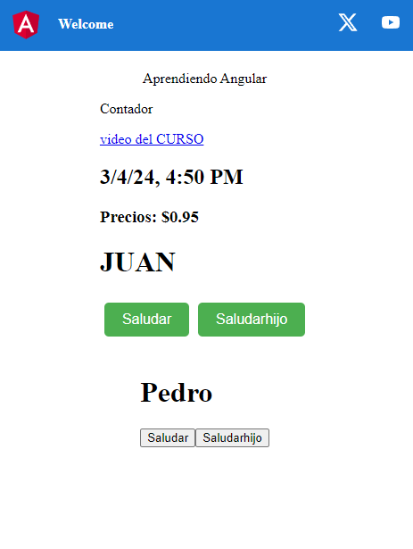

# CursoAngular

This project was generated with [Angular CLI](https://github.com/angular/angular-cli) version 16.2.10.

<p align="center">
  
</p>

## Steps to implement

```python
npm install
npm start
```

inspiration [sergio code](https://www.youtube.com/watch?v=soInCF7nbDw&t=18063s)